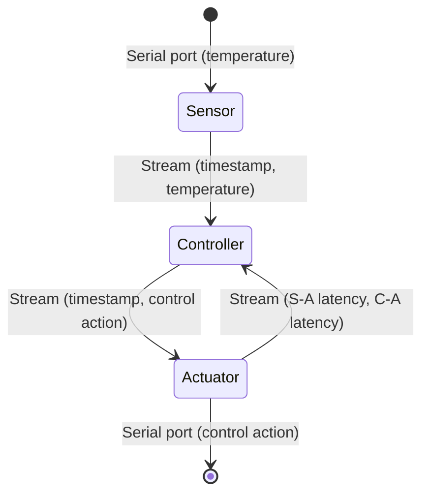

# Experiment overview
The experiment aims at controlling the temperature of a __furnace__.

The __sensor__ node reads from a serial port the temperature from the furnace electronic controller and sends it to the master node, on which the controller is running.

The __controller__ takes the new sample and computes the control action, according to the desired temperature set point, forwarding it to the actuator, including the sample original timestamp (that was received together with the sample). It also logs both the received sample and the computed control action.

The __actuator__ node receives the control action and writes it on the serial port, through which the furnace regulates itself. The actuator also computes the end-to-end latency from the moment in which the temperature was sampled (thanks to the timestamp forwarded by the controller). The actuator also computes the latency on the path controller-actuator. Both the computed latencies are sent back to the master node which logs them.

Latency are sent back to the master since the actuator can only output the control action to the only exposed serial port on the WandStem nodes.

<!--# Controller

As a note, the controller is a __PI controller__ with __anti windup__. The output control action depends on the two previous steps.-->

# Execution
In `utils.h` specify the IDs of the nodes you're going to use as controller, sensor and actuator nodes.  
Use the same `main.cpp` entrypoint for all the boards you're going to use.  
A controller, a sensor and an actuator node will be automatically instantiated to the correct boards.

## Simulations
### Scilab
The script `scripts/control_simulation.sce` simulates the process and the obtained controller in the `scilab` environment.
### TDMH Simulation
The file `main_sim_fornace.cpp` simulates the system. It reads the control action from a serial port and outputs the new simulated temperature on the same serial port. It was used with an `STM32` board to simulate the furnace.  
`main.cpp` is instead the entry for the WandStem nodes. This way the control can be tested through the network but using the simulated process.

# Logs
A simple script is provided for plotting the sensor data and the control action. It can be found in `scripts/plot_control_demo.sh`.  

Logs are compatible with the usual TDMH scripts for analyzing network reliability, streams latency, etc.